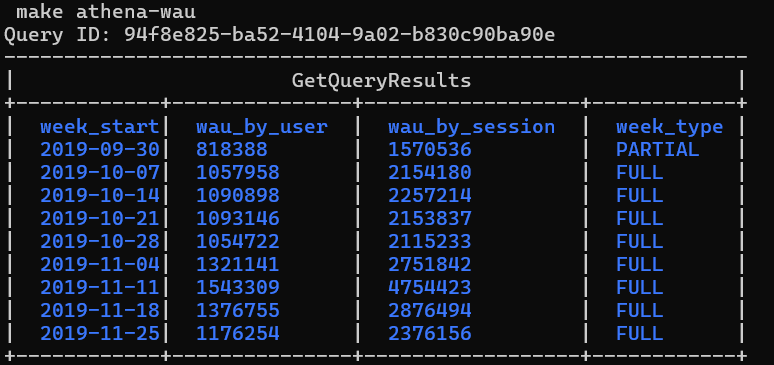
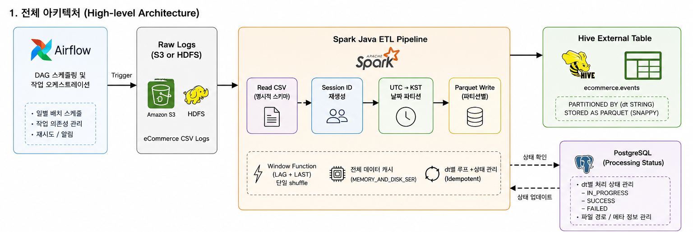
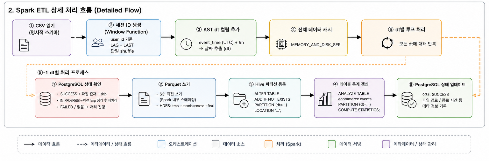

# eCommerce Spark Pipeline

Kaggle eCommerce 로그 데이터를 Spark Java로 처리하여 Hive External Table로 서빙하는 배치 ETL 파이프라인입니다.

원본 UTC 이벤트 시간은 그대로 보존하고, KST 기준 날짜 파티션(`dt`)을 별도로 생성합니다. 또한 사용자 행동 흐름을 기준으로 세션 ID를 재생성한 뒤, Hive 또는 Athena에서 조회할 수 있는 분석용 Parquet 테이블로 적재합니다.

## 1. 실행 결과 요약

AWS EMR에서 Spark Application을 실행한 뒤, Athena에서 `make athena-wau`로 WAU 쿼리를 확인했습니다. 실행 결과 2019년 11월 11일 주의 WAU가 가장 높았습니다.

| week_start | wau_by_user | wau_by_session | week_type |
| --- | ---: | ---: | --- |
| 2019-09-30 | 818,388 | 1,570,536 | PARTIAL |
| 2019-10-07 | 1,057,958 | 2,154,180 | FULL |
| 2019-10-14 | 1,090,898 | 2,257,214 | FULL |
| 2019-10-21 | 1,093,146 | 2,153,837 | FULL |
| 2019-10-28 | 1,054,722 | 2,115,233 | FULL |
| 2019-11-04 | 1,321,141 | 2,751,842 | FULL |
| 2019-11-11 | 1,543,309 | 4,754,423 | FULL |
| 2019-11-18 | 1,376,755 | 2,876,494 | FULL |
| 2019-11-25 | 1,176,254 | 2,376,156 | FULL |

해당 주에는 약 154만 명의 고유 사용자가 활동했고, 세션 기준으로는 약 475만 개의 고유 세션이 집계되었습니다.



## 2. 실행 방법

### AWS 환경

1. S3에 원본 로그와 빌드된 JAR 파일을 업로드합니다.

```text
s3://ecommerce-spark-pipeline-ap-northeast-2/
├── input/ecommerce/
│   ├── 2019-Oct.csv
│   └── 2019-Nov.csv
└── jars/
    └── ecommerce-spark-1.0.jar
```

`data/` 폴더에 CSV 파일을 넣은 뒤 아래 명령으로 버킷 생성과 업로드를 한 번에 처리할 수 있습니다.

```bash
make docker-up    # Maven 빌드 환경(Docker) 시작
make docker-build # JAR 빌드
make s3-setup     # 버킷 생성, CSV 업로드, JAR 업로드
```

2. `.env` 파일에 환경 변수를 설정한 뒤 RDS와 EMR 클러스터를 생성하고 Step을 제출합니다.

```bash
make create-rds      # RDS PostgreSQL 생성 
make rds-endpoint    # 엔드포인트 확인 및 .env 자동 업데이트
make create-cluster  # EMR 클러스터 생성 및 CLUSTER_ID 자동 업데이트 
make cluster-status  # WAITING 상태 확인 후
make submit          # EMR Step 제출
make status          # Step 진행 상태 확인
make check-output    # S3 output 파일 확인
```

EMR은 Glue Data Catalog를 Hive Metastore로 사용하고, 처리 결과는 S3에 Parquet 형식으로 저장됩니다.

3. Athena에서 WAU 쿼리를 실행해 결과를 확인합니다.

```bash
make athena-wau
```

### 로컬 환경

1. CSV 파일을 프로젝트 루트의 `data/` 폴더에 넣습니다.

```text
data/
├── 2019-Oct.csv
└── 2019-Nov.csv
```

2. Docker 기반 로컬 클러스터를 실행하고, HDFS에 CSV를 업로드한 뒤 Spark Job을 실행합니다.

```bash
make docker-up      # 클러스터 시작

# HDFS 초기화 (최초 1회)
docker exec namenode hdfs dfs -mkdir -p /input/ecommerce /data/ecommerce /tmp/ecommerce
docker exec namenode hdfs dfs -setrep -w 1 /
docker exec namenode hdfs dfs -put /mnt/csv/2019-Oct.csv /input/ecommerce/
docker exec namenode hdfs dfs -put /mnt/csv/2019-Nov.csv /input/ecommerce/

make docker-build   # JAR 빌드 (/app/pom.xml 기준)
make docker-submit  # Spark 실행
make wau            # HiveServer2에서 WAU 쿼리 실행
```

처리 결과는 HDFS `/data/ecommerce/dt=YYYY-MM-DD/` 경로에 Parquet으로 저장되고, Hive External Table로 서빙됩니다.

## 3. 아키텍처

현재 저장소에는 Airflow DAG 구현이 포함되어 있지 않습니다. 다만 전체 아키텍처 그림에서는 일별 배치 스케줄링과 작업 오케스트레이션을 Airflow가 담당한다고 가정했습니다. 실제 실행 진입점은 `Makefile`의 EMR Step 제출 또는 로컬 Docker 실행 명령입니다.





## 4. 설계 결정 상세

세부 설계 결정은 카테고리별 문서로 정리했습니다.

| 카테고리 | 주요 내용 |
| --- | --- |
| [Java 선택 이유](docs/java-selection.md) | Java와 Scala 중 Java를 선택한 이유 |
| [KST 기준 Daily Partition](docs/kst-daily-partition.md) | 파티션 레벨 구조, UTC -> KST 변환, cross-day 세션 처리 |
| [세션 ID 재생성](docs/session-id-regeneration.md) | 세션 ID 포맷, Window Function 기반 구현, Data Skew 고려 |
| [Hive External Table](docs/hive-external-table.md) | External Table 선택 이유, 파티션 등록 방식, DDL, 추가 기간 처리 |
| [장애 복구](docs/failure-recovery.md) | 상태 저장 위치, 멱등성, 쓰기 방식, 실패 시나리오별 복구 |
| [WAU 쿼리](docs/wau-query.md) | user/session WAU 계산, Hive와 Athena 함수 차이, 데이터 경계 처리 |

## 5. AI 활용 범위

### 코드와 설계 검토

전반적인 코드 작성과 설계 검토 과정에서 Claude Code와 Codex를 함께 활용했습니다. 특히 세션 경계, 파티션 처리, 멱등성, 장애 복구처럼 실무 관점에서 놓칠 수 있는 부분을 점검하는 용도로 사용했습니다.

### Hive 관련 문법 확인

Hive 사용 경험이 많지 않아 External Table, 파티션 등록, `ANALYZE TABLE`, Hive 함수 차이 등을 확인할 때 AI와 문서를 함께 참고했습니다.

### 오류 원인 확인

AWS 환경에서 실행하면서 발생한 오류 원인을 확인하는 데도 AI를 활용했습니다. 예를 들어 RDS JDBC URL 뒤에 `?ssl=false`를 붙이지 않으면 SSL 인증서 관련 오류가 발생할 수 있다는 점, PostgreSQL 비밀번호 정책처럼 환경 설정에서 놓치기 쉬운 부분을 확인했습니다.
